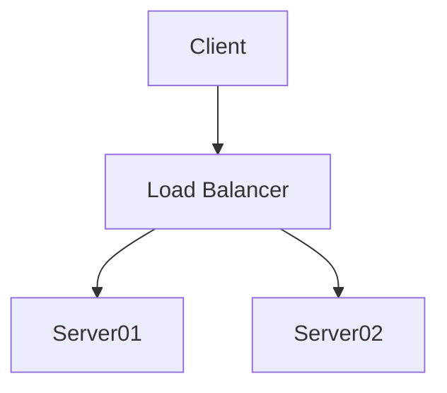

### esta es la pagina 3


### contact

este es mi **contacto:** [Victor](htpssblalaal)


!!! note

    Lorem ipsum dolor sit amet, consectetur adipiscing elit. Nulla et euismod
    nulla. Curabitur feugiat, tortor non consequat finibus, justo purus auctor
    massa, nec semper lorem quam in massa.

``` mermaid
diagrama de clase
nota "De pato a cebra"
Animal <|-- Duck
note for Duck "can fly\ncan swim\ncan dive\ncan help in debugging"
Animal <|-- Fish
Animal <|-- Zebra
Animal : +int age
Animal : +String gender
Animal: +isMammal()
Animal: +mate()
class Duck{
    +String beakColor
    +swim()
    +quack()
}
class Fish{
    -int sizeInFeet
    -canEat()
}
class Zebra{
    +bool is_wild
    +run()
}
```


