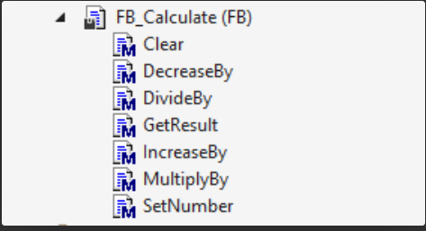

### <span style="color:grey">Fluid Interface:</span>
A popular programming design in high -level languages such as C# is the so -called 'fluid code' or 'fluid interface'.
What is a fluid interface and how to implement it in structured text?We will focus on an implementation of a fluid interface in structured text.

### <span style="color:grey">What is a fluid interface?</span>
According to wikipedia:

In software engineering, a fluid interface is an object -oriented API whose design is largely based on method chaining.Its objective is to increase the readability of the code by creating a specific domain language (DSL).The term was coined in 2005 by Eric Evans and Martin Fowler.

A good example of this 'method chaining' can be seen with the Linq of C#statements:

```javascript
EmployeeNames = EmployeeList.Where(x=› x.Age › 65) 
                            .Select(x=› x) 
                            .Where(x=› x.YearsOfEmployment › 20) 
                            .Select(x=› x.FullName); 
```
By continuously chaining the methods, we can build our complete statement.It is good to know that a fluid interface is often used together with a construction pattern!
We can think of the fluid interface as a concept, while the chaining of methods is an implementation.The objective of the fluid design of the interface is to be able to apply multiple properties to an object connecting the methods with points 
**(.)** instead of having to apply each method individually.

### <span style="color:grey">Why do we want the fluid interface?</span>

- By flexibility, more readable.
- Simpler.
- By maintenance.
- For clarity.
- By ease of writing.
- Easy to extend.

### <span style="color:grey">How do we build a fluid interface?</span>
By making the code understandable and fluid, the fluid interface gives you the impression that it is reading a sentence.To achieve this design pattern, I would need to use **el encadenamiento de métodos**.

In this technique, each method returns an object and can chain all methods.

- See the links referred to, we will see an example in which we will implement a fluid interface to perform mathematical operations...


***
### <span style="color:grey">links Interface Fluid:</span>

- 🔗 [fluent-code, www.plccoder.com](https://www.plccoder.com/fluent-code/)

- 🔗 [fluent-interface-and-method-chaining-in-twincat-3](https://twincontrols.com/community/twincat-knowledgebase/fluent-interface-and-method-chaining-in-twincat-3/#post-278)

- 🔗 [tc3-data-logger creado con interface fluida, github.com/benhar-dev](https://github.com/benhar-dev/tc3-data-logger)

- 🔗 [interface fluida por referencia, getting-limits-twincat-ralph-koettlitz](https://www.linkedin.com/pulse/getting-limits-twincat-ralph-koettlitz/)
***
### <span style="color:grey">Link to the Youtube Video 014:</span>
- 🔗 [014 - OOP IEC 61131-3 PLC -- Interface Fluida](https://youtu.be/k_VFBLGBUKk)