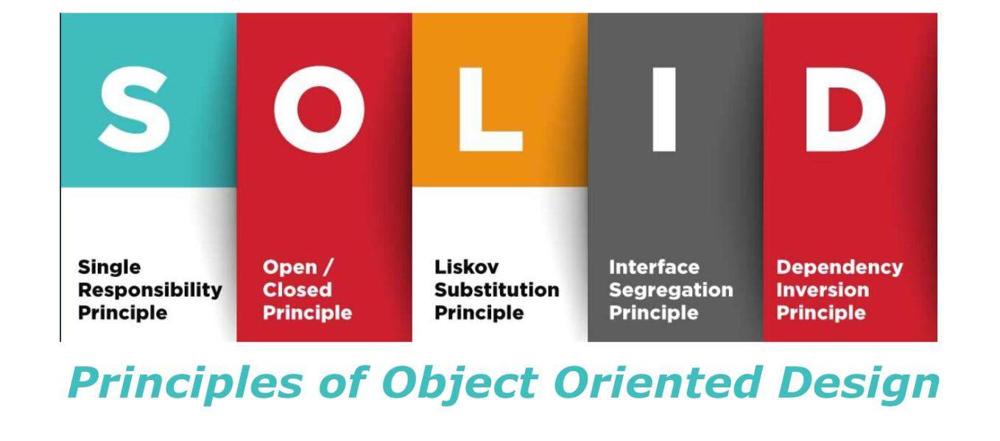

- Proposed by **Robert C.Martin** in 2000.
- His **recommendations** Were to write a code **sustainable, maintainable, scalable and robust**.
- Benefits:

    - High **Cohesion**. Collaboration between classes.
    - Low **Coupling**. Prevent a class from depending strongly on another class.


- <span style="color:orange">Single Responsibility Principle:</span> A class must have **a reason** To exist but not to change.
- <span style="color:orange">Open/closed principle:</span> The software parts must be **open for extension** but **closed for modification**.
- <span style="color:orange">Liskov replacement principle:</span> The **Subtypes classes** should be replaced by their **parents classes**.
- <span style="color:orange">Interface segregation principle:</span> Several **interfaces** work **better than a single**.
- <span style="color:orange">Dependency investment principle:</span> Classes of **high level** should not depend on **Low level** classes.
***
Solid principles are an essential part of object -oriented software development and have proven to be valuable tools to develop clean, maintainable and extensible code.In industrial automation technology, especially in the programming of controllers with IEC 61131-3, it is of particular importance to develop robust and reliable systems.


In addition to solid principles, there are other principles such as:


### Keep It Simple, Stupid (KISS).
```
"Keep it simple, stupid"
```
- Avoid unnecessary complexity in your code, use simple solutions to solve problems.

- **Example:** Instead of writing a personalized algorithm to generate a random number within a range, use the random numbers generator incorporated into its programming language.

### don't Repeat Yourself (DRY).
```
"Do not repeat yourself"
```
- Each piece of knowledge must have a unique, unequivocal and authorized representation within a system.
- Avoid duplication of code and maintain your code base as maintenance and scalable as possible.
- **Example:** Instead of copying and pasteing the same block of code into several places, create a function or module that can be reused.

### Law Of demeter (LOD).
```
"Speak only with your immediate friends"
```
- Demeter's Law (LOD) in programming is a principle that establishes that an object must have limited access to objects related to it and only interact with the objects closest to it.In summary, an object should not know the internal structure of other objects and should only communicate with them through a limited interface.
- **Example:** If you have a "person" class that has a "Getname ()" method and another "company" class that has a "Getpersone ()" method.Instead of directly accessing the name of the person from the company class, the "Getname ()" Method of the person person from outside the company class should be called, to avoid unnecessary dependence and maintain limited communication between objects.
### You Ain't Gonna Need It (YAGNI).
```
"You will not need it"
```
- Do not add functionality to your code until you really need it.

- **Example:** Do not add a function to its application that allows users to change the color of the source if it is not part of the main requirements.


All these principles have the common objective of improving the maintainability and reuse of the software.

The principles SOLID They are not rules or laws that must be followed strictly.They are guidelines that can help us improve our code quality and design skills.They are not destined to be applied blind or dogmatically.They are destined to be used with common sense and judgment.
***
### <span style="color:grey">Links SOLID:</span>
- 🔗 [Cómo explicar conceptos de programación orientada a objetos a un niño de 6 años](https://www.freecodecamp.org/news/object-oriented-programming-concepts-21bb035f7260/#:~:text=The%20four%20principles%20of%20object,abstraction%2C%20inheritance%2C%20and%20polymorphism.)

- 🔗 [iec-61131-3-solid-five-principles-for-better-software,stefanhenneken.net](https://stefanhenneken.net/2021/07/25/iec-61131-3-solid-five-principles-for-better-software/#more-1892)

- 🔗 [Libro SOLID IEC61131-3 en Aleman de Stefanhenneken](https://www.bod.de/buchshop/anwendung-der-solid-prinzipien-mit-der-iec-61131-3-stefan-henneken-9783757870706)

- 🔗 [kentcdodds.com,aha-programming](https://kentcdodds.com/blog/aha-programming)

-  🔗 [Qué son los principios SOLID ? Por qué son tan importantes y verás que ya los aplicas sin saberlo !!](https://www.youtube.com/watch?v=EbpM-i6GZjs)


