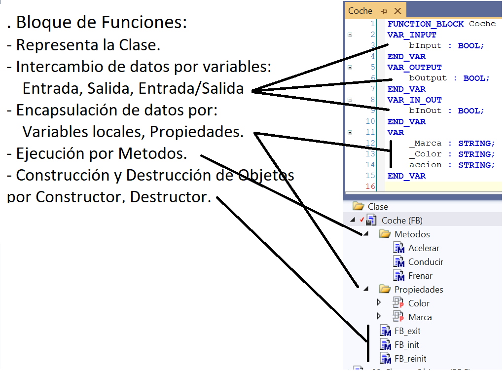

### Declaracion de un Function Block:
```iecst
FUNCTION_BLOCK <access specifier> <function block> | EXTENDS <function block> | IMPLEMENTS <comma-separated list of interfaces>
```
### Implementación Bloque de Funciones:




### Modificadores de acceso Bloque de Funciones:
Podemos tener 2 modificadores de acceso para el Bloque de Funciones:

- <span style="color:orange">PUBLIC:</span> 
No hay restricciones, se puede llamar desde cualquier lugar. 
    - Si no ponemos nada al declarar el FB es lo mismo que PUBLIC.
    - Cualquiera puede llamar o crear una instancia del FB.
    - Se puede usar para la herencia al ser public. 
- <span style="color:orange">INTERNAL:</span> 
    - Solo se puede acceder al FB desde el mismo espacio de nombres. 
    - Esto permite que el FB este disponible solo dentro de una determinada biblioteca.
La configuración predeterminada donde no se define ningún especificador de acceso es PUBLIC .    
***    
- <span style="color:orange">FINAL:</span>
    - (en TwinCAT 3 no sale por defecto para seleccionarlo al crear un FB, pero se puede añadir mas tarde despues de crearlo...) 
    - El FB no puede servir como un bloque de funciones principal. 
    - Los métodos y las propiedades de esta POU no se pueden heredar. 
    - FINAL solo está permitido para POU del tipo FUNCTION_BLOCK.
- <span style="color:orange">ABSTRACT:</span> 
bloques de funciones abstractas
```javascript
FUNCTION_BLOCK PUBLIC ABSTRACT FB_Foo
```
    - Tan pronto como un método o una propiedad se declaran como abstractos , el bloque de funciones también debe declararse como abstracto .
    - No se pueden crear instancias a partir de FB abstractos. Los FB abstractos solo se pueden usar como FB básicos cuando se heredan.
    - Todos los métodos abstractos y todas las propiedades abstractas deben sobrescribirse para crear un FB no abstracto. Un método abstracto o una propiedad abstracta se convierte en un método no abstracto o una propiedad no abstracta al sobrescribir.
    - Los bloques de funciones abstractas pueden contener además métodos no abstractos y/o propiedades no abstractas.
    - Si no se sobrescriben todos los métodos abstractos o todas las propiedades abstractas durante la herencia, el FB heredado solo puede ser un FB abstracto (concretización paso a paso).
    - Se permiten punteros o referencias de tipo FB abstracto. Sin embargo, estos pueden referirse a FB no abstractos y, por lo tanto, llamar a sus métodos o propiedades (polimorfismo).   

***
<span style="color:orange"> EXTENDS:</span> 
- Si en la declaración de un FUNCTION_BLOCK añadimos la palabra EXTENDS seguida del nombre del FB del cual queremos heredar, significa que heredamos todos sus metodos y propiedades.(principio de Herencia)
- Un FB solo puede heredar de una Clase FB.
***
<span style="color:orange"> IMPLEMENTS:</span> 
- Si en la declaración de un FUNCTION_BLOCK añadimos la palabra IMPLEMENTS seguido del nombre de la interfaz o interfaces separadas por comas.
- Si en el FB se implementa una interfaz es obligatorio en el FB crear la programación de los metodos y propiedades de la interfaz implementada.
***

```javascript
- Ejemplos de declaracion de FUNCTION_BLOCK:
FUNCTION_BLOCK INTERNAL ABSTRACT FB
FUNCTION_BLOCK INTERNAL FINAL FB
FUNCTION_BLOCK PUBLIC FINAL FB
FUNCTION_BLOCK ABSTRACT FB
FUNCTION_BLOCK PUBLIC ABSTRACT FB
FUNCTION_BLOCK FB EXTENDS FB1 IMPLEMENTS Interface1, Interface2, Interface3
```
### Tipo de variables que se pueden declarar en un FUNCTION_BLOCK:
!!!!!!!!!!! mirar cuales son exactamente las que se pueden declarar en un FB !!!!!!!!!!!!!!!!!!!!!!!!!!!!!!!!!!!!!!!!!!!!!!!!!!!

- [Local Variables - VAR](https://infosys.beckhoff.com/content/1033/tc3_plc_intro/2528755083.html)
- [Input Variables - VAR_INPUT](https://infosys.beckhoff.com/content/1033/tc3_plc_intro/2528760459.html)
- [Output Variables - VAR_OUTPUT](https://infosys.beckhoff.com/content/1033/tc3_plc_intro/2528765835.html)
- [Input/Output Variables - VAR_IN_OUT, VAR_IN_OUT CONSTANT](https://infosys.beckhoff.com/content/1033/tc3_plc_intro/2528771211.html)
- [Global Variables - VAR_GLOBAL](https://infosys.beckhoff.com/content/1033/tc3_plc_intro/2528776587.html)
- [Temporary Variable - VAR_TEMP](https://infosys.beckhoff.com/content/1033/tc3_plc_intro/2528781963.html)
- [Static Variables - VAR_STAT](https://infosys.beckhoff.com/content/1033/tc3_plc_intro/2528787339.html)
- [External Variables - VAR_EXTERNAL](https://infosys.beckhoff.com/content/1033/tc3_plc_intro/2528792715.html)
- [Instance Variables - VAR_INST](https://infosys.beckhoff.com/content/1033/tc3_plc_intro/2528798091.html)
- [Remanent Variables - PERSISTENT, RETAIN](https://infosys.beckhoff.com/content/1033/tc3_plc_intro/2528803467.html)
- [SUPER](https://infosys.beckhoff.com/content/1033/tc3_plc_intro/2528837771.html)
- [THIS](https://infosys.beckhoff.com/content/1033/tc3_plc_intro/2528843147.html)
- [Variable types - attribute keywords](https://infosys.beckhoff.com/content/1033/tc3_plc_intro/2528848523.html)
    - [RETAIN: for remanent variables of type RETAIN](https://infosys.beckhoff.com/content/1033/tc3_plc_intro/2528803467.html)
    - [PERSISTENT: for remanent variables of type PERSISTENT](https://infosys.beckhoff.com/content/1033/tc3_plc_intro/2528803467.html)
    - [CONSTANT: for constants](https://infosys.beckhoff.com/content/1033/tc3_plc_intro/2529284235.html#2529371275)


