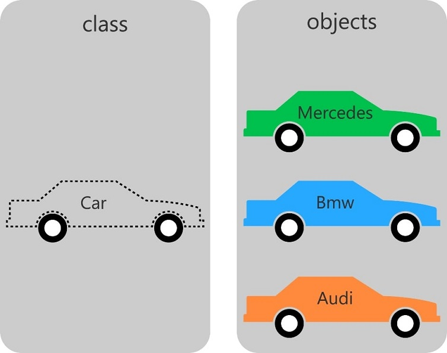

### <span style="color:grey">Clases y Objetos:</span>

- Una Clase es una **plantilla**.
- Un Objeto es la **instancia de una Clase**.



```text
En este Ejemplo Nos encontramos la Clase Coche,
y hemos instanciado esta Clase para tener los Objetos de Coches 
Mercedes, Bmw y Audi...
```
### <span style="color:grey">Representacion de la Clase Coche en STL OOP IEC 61131-3</span>
```iecst
FUNCTION_BLOCK Coche
VAR_INPUT
END_VAR
VAR_OUTPUT
END_VAR
VAR
	_Marca : STRING;
	_Color : STRING;
	accion : STRING;
END_VAR
----------------------------------------------------------------
METHOD PUBLIC Acelerar
accion := 'acelerar';
----------------------------------------------------------------
METHOD PUBLIC Conducir
accion := 'conducir';
----------------------------------------------------------------
METHOD PUBLIC Frenar
accion := 'frenar';
----------------------------------------------------------------
PROPERTY PUBLIC Color : STRING
Get
    Color := _Color;
Set
    _Color := Color;
----------------------------------------------------------------
PROPERTY PUBLIC Marca : STRING
Get
    Marca := _Marca;
Set
    _Marca := Marca;
```
Instancia de la clase en los Objetos: Mercedes,Bmw y Audi y llamadas a sus metodos y propiedades...
```iecst
PROGRAM _01_Clase_y_Objetos
VAR
	// tenemos la Clase Coche y la instanciamos y obtenemos los Objetos: Mercedes, Bmw y Audi.
	Mercedes : Coche;
	Bmw : Coche;
	Audi: Coche;
	
	Color : STRING;
	Marca : STRING;
	
	Acelerar : BOOL;
	Conducir:  BOOL;
	Frenar  : BOOL;	
END_VAR

//Objeto Mercedes
//llamadas a sus métodos.
IF Acelerar THEN
	Mercedes.Acelerar();
	Acelerar := FALSE;
END_IF

IF Conducir THEN
	Mercedes.Conducir();
	Conducir := FALSE;
END_IF

IF Frenar THEN
	Mercedes.Frenar();
	Frenar := FALSE;
END_IF

//llamadas a sus propiedades.
Mercedes.Marca := 'Mercedes';
Mercedes.Color := 'Negro';
Color := Mercedes.Color;
```
### <span style="color:grey">Links:</span>

- 🔗 [methods-properties-and-inheritance (stefanhenneken)](https://stefanhenneken.net/2017/04/23/iec-61131-3-methods-properties-and-inheritance/)

- 🔗 [Object Oriented Industrial Programming (OOIP) -- March 2021 CODESYS Tech Talk](https://www.youtube.com/watch?v=vRGaW4L762k)

- 🔗 [Clase de Programación Orientada a Objetos en una hora ! Cómo crear tus entidades, herencia y más](https://www.youtube.com/watch?v=2jfIfeY4lrQ)

- 🔗 [Object Oriented Programming (OOP) in Java Course](https://www.youtube.com/playlist?list=PL9gnSGHSqcno1G3XjUbwzXHL8_EttOuKk)

***
### <span style="color:grey">Link al Video de Youtube 002:</span>
- 🔗 [002 - OOP IEC 61131-3 PLC -- Clase y Objeto](https://youtu.be/3IudQIj1noo)
