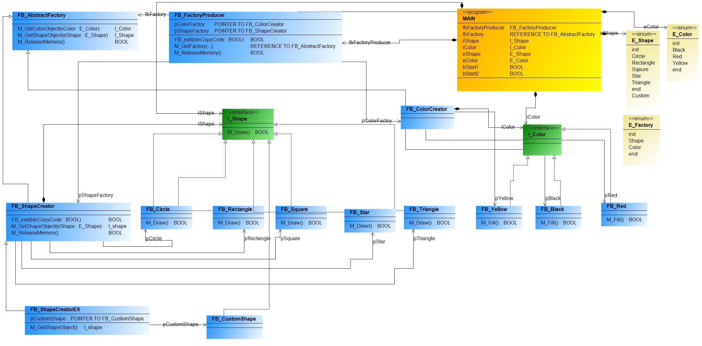

- Abstract Factory es un patrón de diseño creacional que le permite producir familias de objetos relacionados sin especificar sus clases concretas.
- En el 👉[**patrón de fábrica abstracto**](https://refactoring.guru/design-patterns/abstract-factory) , una superfábrica que genera más fábricas es el centro de los patrones de fábrica abstractos. Otro nombre para esta instalación es fábrica de fábricas. Este tipo de patrón de diseño entra en la categoría de patrón de creación porque ofrece una de las mejores formas de crear un objeto.

- Una fábrica de objetos relacionados se crea a través de una interfaz utilizando el patrón de fábrica abstracto sin necesidad de declarar explícitamente las clases de los objetos. Según el patrón Factory, cada fábrica producida puede entregar objetos.

El diagrama de clases UML de la fábrica abstracta es el siguiente:

Implementación de ejemplo practico en TwinCAT 3:

***
### Links de Patrones de Diseño Fábrica Abstracta:
- 🔗 [iec-61131-6-abstract-factory-english,stefanhenneken.net](https://stefanhenneken.net/2014/11/16/iec-61131-6-abstract-factory-english/)

- 🔗 [Abstract Factory Design Pattern](https://www.twincontrols.com/community/twincat-knowledgebase/abstract-factory-design-pattern/#post-483)

- 🔗 [refactoring.guru,abstract-factory](https://refactoring.guru/design-patterns/abstract-factory)
***
### Link al Video de Youtube_36:
- 🔗 [Factoy Abstract Design Pattern Youtube](https://youtu.be/YKSCzbzmOMU)
***