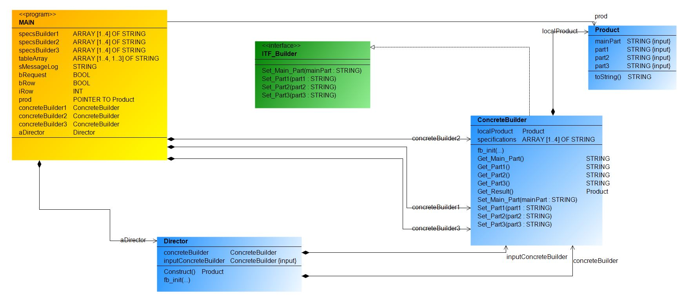
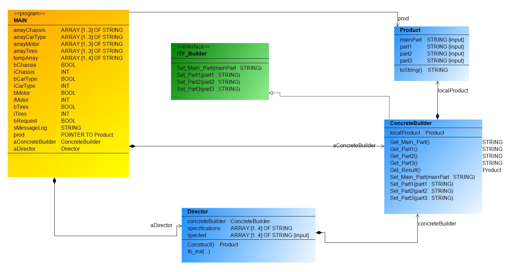

- 👉[**Builder**](https://refactoring.guru/design-patterns/builder) es un patrón de diseño creacional que nos permite construir objetos complejos paso a paso. 
- El patrón nos permite producir distintos tipos y representaciones de un objeto empleando el mismo código de construcción.

El diagrama de clases UML del Patrón Creacional Builder es el siguiente:

***
Implementación 1 del Patrón de Diseño Creacional Builder, ejemplo practico en TwinCAT 3:

***
Implementación 2 de Patrón de Diseño Creacional Builder, ejemplo practico en TwinCAT 3:

***
### Links de Patrones de Diseño Builder:
- 🔗 [github.com,Aliazzzz,Applied-Design-Patterns-in-CODESYS-V3](https://github.com/Aliazzzz/Applied-Design-Patterns-in-CODESYS-V3)

- 🔗 [0w8States/PLC-Design-Patterns](https://github.com/0w8States/PLC-Design-Patterns)

- 🔗 [refactoring.guru, builder](https://refactoring.guru/design-patterns/builder)
***
### Link al Video de Youtube_37:
- 🔗 [Builder Design Pattern Youtube](https://youtu.be/lYHHAKN07-s)