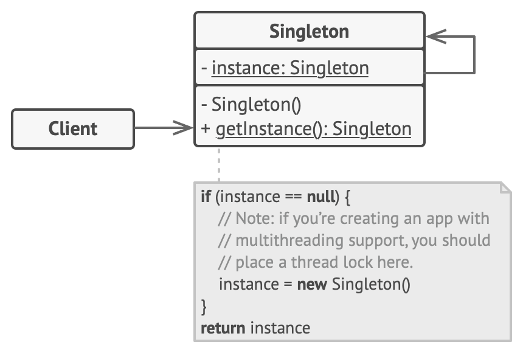
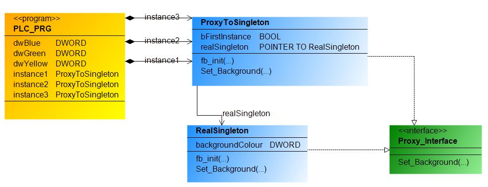

- 👉[**Singleton**](https://refactoring.guru/design-patterns/singleton) es un patrón de diseño creacional que le permite garantizar que una clase tenga solo una instancia, al tiempo que proporciona un punto de acceso global a esta instancia desde cualquier parte del programa.

El diagrama de clases UML del Patrón Creacional Singleton es el siguiente:

- La clase Singleton declara el método estático getInstance que devuelve la misma instancia de su propia clase.

- El constructor de Singleton debe estar oculto en el código del cliente. Llamar al getInstance método debería ser la única forma de obtener el objeto Singleton.

- Esto es útil cuando solo se necesita una instancia de una clase para coordinar acciones en todo el programa. En resumen, es una forma de controlar la creación de objetos.
***
Implementación de Singleton ejemplo practico en TwinCAT 3:

***
### Links de Patrones de Diseño Singleton:
- 🔗 [github.com,Aliazzzz,Applied-Design-Patterns-in-CODESYS-V3](https://github.com/Aliazzzz/Applied-Design-Patterns-in-CODESYS-V3)

- 🔗 [github.com,0w8States,PLC-Design-Patterns,Singleton](https://github.com/0w8States/PLC-Design-Patterns/tree/master/Creational_Patterns/Singleton)

- 🔗 [refactoring.guru, singleton](https://refactoring.guru/design-patterns/singleton)

- 🔗 [www.youtube.com, Aprende los principales patrones de diseño con .NET y C#. Patron Singleton](https://www.youtube.com/watch?v=n5CuGw0IvXo&t=47s)

- 🔗 [www.youtube.com, SINGLETON | PATRONES de DISEÑO](https://www.youtube.com/watch?v=GGq6s7xhHzY)

- 🔗 [www.youtube.com, ▷ PATRÓN SINGLETON | Aprende qué es y cómo se utiliza 👨‍💻 este Patrón de diseño](https://www.youtube.com/watch?v=Z7Z-PJEIEsc)

- 🔗 [www.youtube.com, Patrones de diseño: Singleton](https://www.youtube.com/watch?v=cNoxcc0ca4I)
***
### Link al Video de Youtube_39:
- 🔗 [Singleton Design Pattern Youtube](https://youtu.be/Y0SI90RvwPc)