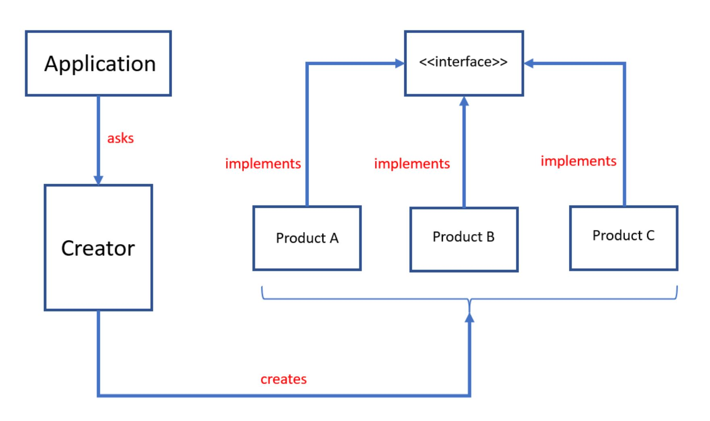

El [patrón de diseño del método de fábrica](https://refactoring.guru/design-patterns/factory-method) es uno de los [patrones de diseño creacional](https://refactoring.guru/design-patterns/creational-patterns) que se ocupa de los problemas de creación de objetos durante el diseño y desarrollo de software. 

Estados de patrón de método Factory/Factory que definen una interfaz o clase abstracta para crear un objeto, pero permiten que las subclases decidan qué clase instanciar/crear. En lugar de crear instancias de clases en la aplicación principal, las subclases son responsables de realizar esta tarea. 

El método de fábrica también se conoce como Constructor Virtual.

El diagrama de clases UML del método de fábrica es el siguiente: 

Implementación de ejemplo practico en TwinCAT 3:

***
### Links de Patrones de Diseño:
- 🔗 [refactoring.guru, factory-method](https://refactoring.guru/design-patterns/factory-method)
- 🔗 [twincontrols.com, Factory Method Design Pattern](https://www.twincontrols.com/community/twincat-knowledgebase/factory-method-design-pattern/)
***
### Link al Video de Youtube_35:
- 🔗 [Factoy Method Design Pattern Youtube]()