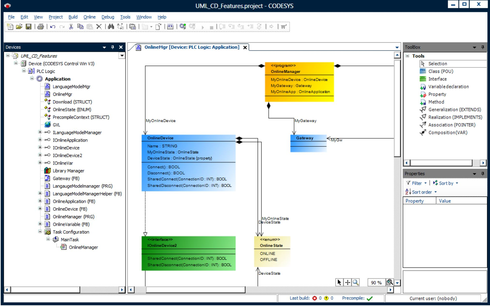
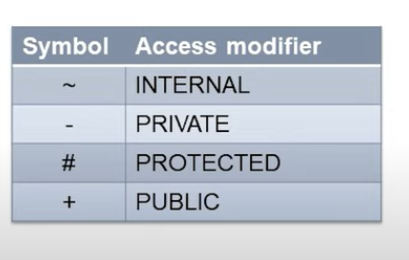
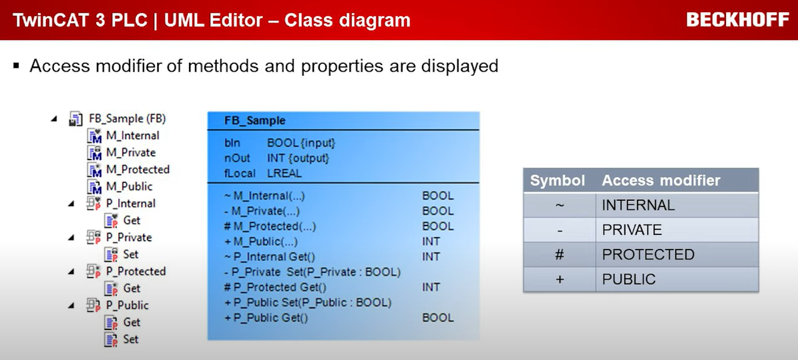
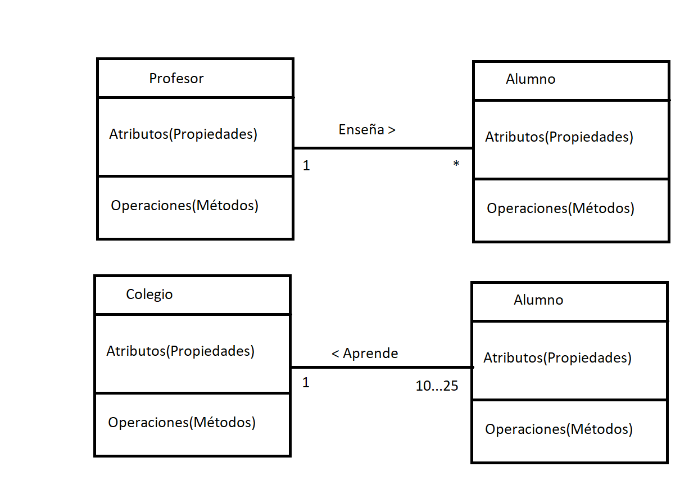

###  Diagrama de Clases en UML:
### ¿Qué son?:
- El diagrama de clases es un diagrama que muestra **"cómo"** se organiza y estructura un sistema.
- Se enfoca en la estructura interna del sistema y muestra cómo está organizado en términos de clases y objetos.
- Describe cómo se implementará el sistema desde una perpectiva orientada a objetos.

Esta imagen es un Ejemplo en Codesys de Diagrama de Clases:

### ¿Para qué sirve?:
- Representar la estructura del sistema
- Visualizar relaciones
- Facilitar el diseño del sistema
- Documentar el sistema
- Promover la reutilización
- Facilitar la comunicación
- Base para otros diagramas UML
### Representación gráfica:
- Para representar Objetos y Clases, se utiliza el "clasificador".
- Cada caja representa un bloque de función y siempre se divide en tres secciones horizontales. 
- La sección superior muestra el nombre del bloque de funciones.
- La sección central enumera sus atributos/propiedades.
- La sección inferior enumera todos sus operaciones/métodos. 

Los Modificadores de acceso de los metodos y las propiedades tienen una Visibilidad y su simbologia es la siguiente:

La jerarquía de herencia se puede representar en forma de diagrama. 

El lenguaje de modelado unificado (UML) es el estándar establecido en esta área. UML define varios tipos de diagramas que describen tanto la estructura como el comportamiento del software.

Una buena herramienta para describir la jerarquía de herencia de bloques de funciones es el diagrama de clases.

Los diagramas UML se pueden crear directamente en TwinCAT 3. Los cambios en el diagrama UML tienen un efecto directo en las POU. Por lo tanto, los bloques de funciones se pueden modificar a través del diagrama UML.

***
Los Modificadores de acceso de los metodos y las propiedades se veran segun la simbologia:(Disponible a partir de la versión de TwinCAT 3.1.4026)

### ¿Qué es la asociación?:
- La Asociación entre clases se utiliza para representar relaciones entre diferentes clases. Esta relación significa que una clase conoce a otra y tiene una referencia a ella.

### ¿Cómo se representa?:
- La asociación se representa con una línea que conecta dos clases en un diagrama de clases.
- Se suele leer como "tiene..."
- Tipo: Adicionalmente se le puede indicar un verbo para especificar el tipo de asociación.
- Direccionalidad: Paréntesis angulares se colocan junto al verbo para indicar direccionalidad
- Multiplicidad: Adicionalmente se pueden utilizar números o rangos que indican cuántas instancias de una clase están asociadas con una instancia de la otra clase.

***
### Links UML listado de referencias:

- 🔗 [stefanhenneken.net, UML Class](https://stefanhenneken.net/2017/04/23/iec-61131-3-methods-properties-and-inheritance/)
- 🔗 [www.lucidchart.com/tutorial-de-diagrama-de-clases-uml](https://www.lucidchart.com/pages/es/tutorial-de-diagrama-de-clases-uml)

- 🔗 [www.edrawsoft.com/uml-class-diagram-explained](https://www.edrawsoft.com/es/article/uml-class-diagram-explained.html)

- 🔗 [blog.visual-paradigm.com/what-are-the-six-types-of-relationships-in-uml-class-diagrams](https://blog.visual-paradigm.com/es/what-are-the-six-types-of-relationships-in-uml-class-diagrams/)

- 🔗 [Ingeniería del Software: Fundamentos de UML usando Papyrus](https://www.udemy.com/course/ingenieria-del-software-fundamentos-de-uml-usando-papyrus/learn/lecture/30833780?start=11#overview)

- 🔗 [plantuml.com/class-diagram](https://plantuml.com/es/class-diagram)

- 🔗 [www.planttext.com](https://www.planttext.com/)

- 🔗 [UML Infosys Beckhoff](https://infosys.beckhoff.com/english.php?content=../content/1033/tf1910_tc3_uml/1510519307.html&id=)

- 🔗 [Tutorial - Diagrama de Clases UML](https://www.youtube.com/watch?v=Z0yLerU0g-Q)

- 🔗 [Curso UML. Diagrama de clases I. Vídeo 9](https://www.youtube.com/watch?v=r75NwLxR_iU)

- 🔗 [Curso UML. Diagrama de clases II. Vídeo 10](https://www.youtube.com/watch?v=rWgQxHdunsw)

- 🔗 [Curso UML. Diagramas de clases III. Traslado a código I. Vídeo 11](https://www.youtube.com/watch?v=PGZGCT3c23g)

***
### Link al Video de Youtube_30:
- 🔗 [030 - OOP IEC 61131-3 PLC -- UML - Diagrama de Clases](https://youtu.be/s2NV8Yt_rdY)