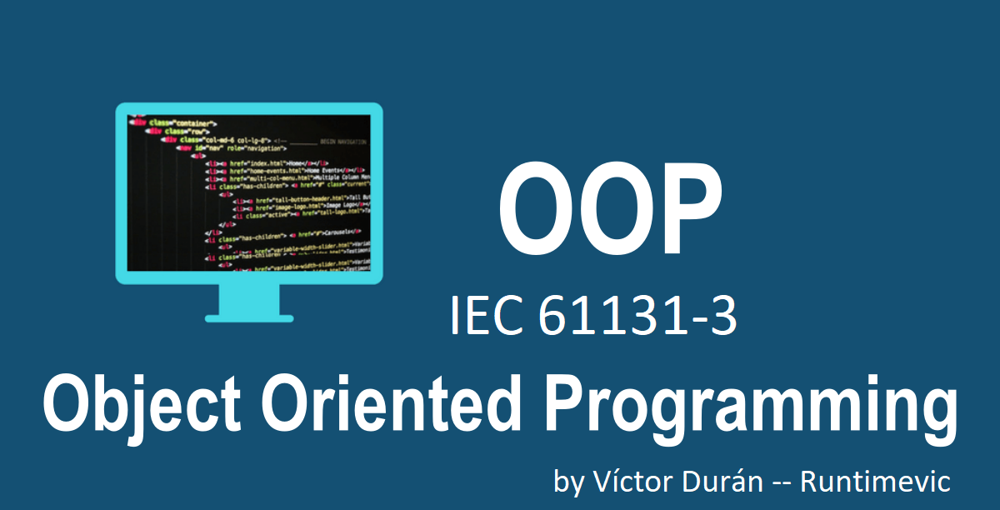

<span style="color:green"><font size="5">
📖 Curso Programación Orientada a Objetos Youtube -- OOP :
</font></span>


<span style="color:green"><font size="3">
by Runtimevic -- Víctor Durán Muñoz.
</font></span>
***
### <span style="color:grey">¿ Qué es OOP?</span>

- Es un paradigma que hace uso de los objetos para la construcción de los software.

    . ¿ Qué es un paradigma?
    
    - Tiene diferentes interpretaciones, puede ser un **modelo**, **ejemplo** o **patrón.**
    - Es una **forma** o un **estilo** de programar.
- se busca plasmar la realidad hacia el código.

### <span style="color:grey">¿Cómo pensar en Objetos?</span>

- Enfocarse en **algo de la realidad.**
- Detalla sus **atributos, (propiedades)**
- Detalla sus **comportamientos (metodos)**

```text
📱 Ejemplo: (Telefono móvil-smartphone)

. ¿Qué atributos (Propiedades) reconocemos? 
    - color.
    - marca.
. ¿Qué se puede hacer? (Metodos)
    - Realizar llamadas.
    - Navegar por internet. 
```

```text
🚗 Ejemplo: (Coche)

. ¿Qué atributos (Propiedades) reconocemos? 
    - color.
    - marca.
. ¿Qué se puede hacer? (Metodos)
    - conducir.
    - frenar. 
    - acelerar.
```
***
### <span style="color:grey">Links:</span>

- 🔗 [Codesys admite OOP](https://help.codesys.com/api-content/2/codesys/3.5.14.0/en/_cds_f_object_oriented_programming/#cd69b36a931eb47c0a8640e01dc4fc9-id-8938ae329606a7abc0a8640e00eabd77)

- 🔗 [Beckhoff TwinCAT 3 admite OOP](https://infosys.beckhoff.com/english.php?content=../content/1033/tc3_plc_intro/2527303819.html&id=)

- 🔗 [Why Object Oriented PLC Programming is Essential for Industrial Automation](https://twincontrols.com/community/lounge/why-object-oriented-plc-programming-is-essential-for-industrial-automation/)

- 🔗 [cascadingsoft.com,object-oriented-programming-oop-concepts-benefit](https://cascadingsoft.com/object-oriented-programming-oop-concepts-benefit/)

-  🔗 [object-oriented-programming-in-plc-ooip-or-oops-supported-plc](https://www.shaswatraj.com/post/object-oriented-programming-in-plc-ooip-or-oops-supported-plc)

- 🔗 [The Benefits of OOP in PLC Programming: A Case Study with a Conveyor System](https://www.linkedin.com/pulse/benefits-oop-plc-programming-case-study-conveyor-system-zhou-gong/?utm_source=share&utm_medium=member_android&utm_campaign=share_via)

- 🔗 [Fundamental Concepts of Object Oriented Programming](https://www.youtube.com/watch?v=m_MQYyJpIjg)

- 🔗 [www.genbeta.com, programacion-orientada-a-objetos-principales-conceptos-explicados-para-todos-publicos](https://www.genbeta.com/a-fondo/que-programacion-orientada-a-objetos-principales-conceptos-explicados-para-todos-publicos)
***
### <span style="color:grey">Link al Video de Youtube 001:</span>
- 🔗 [001 - OOP IEC 61131-3 PLC -- Introducción a la pagina de documentación SSG, repositorio...](https://www.youtube.com/watch?v=a7eNCefcjGM)


