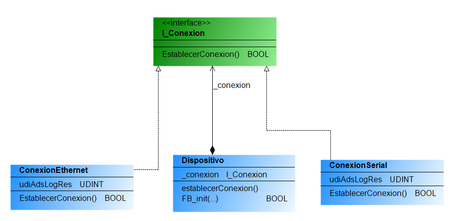

### <span style="color:grey"> Principio de Inversión de Dependencia -- (Dependency Inversion Principle) DIP :</span>

El principio de inversión de dependencia establece que los módulos de **nivel superior** no deben depender de los módulos de **nivel inferior**, sino que ambos deben depender de abstracciones.

### <span style="color:grey">Ejemplo:</span>

```javascript
INTERFACE I_Conexion
// interfaz para la conexión
METHODS
    EstablecerConexion : BOOL; // método para establecer la conexión
END_INTERFACE

FUNCTION_BLOCK ConexionSerial IMPLEMENTS I_Conexion // implementa la interfaz I_Conexion
// implementación para la conexión serial
END_FUNCTION_BLOCK

FUNCTION_BLOCK ConexionEthernet IMPLEMENTS I_Conexion // implementa la interfaz I_Conexion
// implementación para la conexión ethernet
END_FUNCTION_BLOCK

FUNCTION_BLOCK Dispositivo

// constructor
Dispositivo(conexion);

// método para establecer la conexión
establecerConexion();

END_FUNCTION_BLOCK
```



- Esto permite que se pueda pasar cualquier objeto que implemente la interfaz `I_Conexion`, lo que cumple con el principio de inversión de dependencias.

- Además, se utiliza el método `EstablecerConexion` definido en la interfaz `I_Conexion`, lo que demuestra cómo se puede utilizar una abstracción (la interfaz) para trabajar con diferentes implementaciones concretas de manera uniforme.

***
### <span style="color:grey">Links:</span>
- 🔗 [stefanhenneken.net,iec-61131-3-solid-the-dependency-inversion-principle](https://stefanhenneken.net/2022/02/09/iec-61131-3-solid-the-dependency-inversion-principle/)

- 🔗 [Twincontrols__Dependency Injection](https://www.twincontrols.com/community/twincat-knowledgebase/dependency-injection-in-twincat/#post-351)

- 🔗 [tech.tribalyte.eu, blog-principios-solid-dependency](https://tech.tribalyte.eu/blog-principios-solid-dependency)
***
### <span style="color:grey">Link al Video de Youtube 028:</span>
- 🔗 [028 - OOP IEC 61131-3 PLC -- SOLID - DIP](https://youtu.be/Bh-9GLcksPQ)