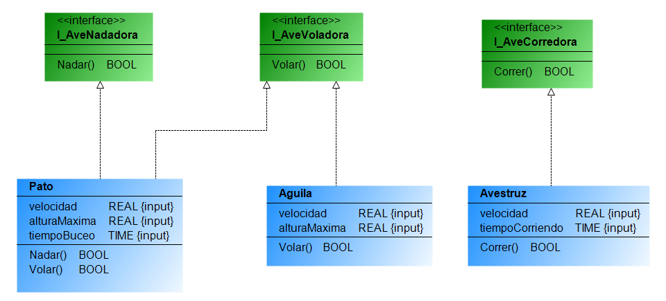

### <span style="color:grey"> Principio de Segregación de Interfaz -- (Interface Segregation Principle) ISP :</span>

- El principio de segregación de interfaz establece que una clase no debe implementar interfaces que no utilice y que debe dividirse en interfaces más pequeñas y específicas.
- El principio de segregación de interfaz se debe de mirar desde el lado de los clientes que implementan las interfaces que no tengan metodos y/o propiedades que no tengan sentido para ese cliente.

### <span style="color:grey">Ejemplo:</span>

```javascript
INTERFACE I_AveVoladora
// interfaz para las aves voladoras
    METHODS
        Volar : BOOL; // método para volar
END_INTERFACE

INTERFACE I_AveNadadora
// interfaz para las aves nadadoras
    METHODS
        Nadar : BOOL; // método para nadar
END_INTERFACE

INTERFACE I_AveCorredora
// interfaz para las aves corredoras
    METHODS
        Correr : BOOL; // método para correr
END_INTERFACE

FUNCTION_BLOCK Pato IMPLEMENTS I_AveVoladora, I_AveNadadora
// implementa las interfaces I_AveVoladora e I_AveNadadora
VAR_INPUT
    velocidad : REAL;
    alturaMaxima : REAL;
    tiempoBuceo : TIME;
END_VAR

// implementación para el pato
// métodos para volar y nadar

END_FUNCTION_BLOCK

FUNCTION_BLOCK Aguila IMPLEMENTS I_AveVoladora
// implementa la interfaz I_AveVoladora solamente
VAR_INPUT
    velocidad : REAL;
    alturaMaxima : REAL;
END_VAR

// implementación para el águila
// método para volar

END_FUNCTION_BLOCK

FUNCTION_BLOCK Avestruz IMPLEMENTS I_AveCorredora
// implementa la interfaz I_AveCorredora solamente
VAR_INPUT
    velocidad : REAL;
    tiempoCorriendo : TIME;
END_VAR

// implementación para el avestruz
// método para correr

END_FUNCTION_BLOCK
```


- De esta manera, cada clase tiene solo los métodos necesarios y se divide en interfaces más pequeñas y específicas. Además, se utilizan interfaces en lugar de function blocks para implementar el principio de segregación de interfaz. 
- Esto permite una mayor flexibilidad y evita la necesidad de implementar métodos innecesarios en una clase.
***
### <span style="color:grey">Links:</span>
- 🔗 [stefanhenneken.net,iec-61131-3-solid-the-interface-segregation-principle](https://stefanhenneken.net/2023/02/25/iec-61131-3-solid-the-interface-segregation-principle/)

- 🔗 [IEC 61131-3: SOLID – The Interface Segregation Principle](https://stefanhenneken.net/2023/02/25/iec-61131-3-solid-the-interface-segregation-principle/#more-2505)

- 🔗 [🤓¡PATRONES de DISEÑO de Typescript que te AYUDARÁN! Guía + Interface Segregation Principle | PT 1.](https://www.youtube.com/watch?v=Ph7kXNmski8)

- 🔗 [CodelyTV - Redescubre la programación, Principio de Segregación de Interfaces - SOLID](https://www.youtube.com/watch?v=EzUIbMdxJTk)

- 🔗 [CodelyTV - Redescubre la programación, Errores comunes al diseñar Interfaces - #SOLID - ISP](https://www.youtube.com/watch?v=mDAQLkdNGHU)

- 🔗 [hdeleon.net, Principios SOLID: Principio de Segregación de Interfaces ISP](https://www.youtube.com/watch?v=4741GhnZmOk)

- 🔗 [DevExpert - Formación Android & Kotlin, Principio de SEGREGACIÓN de INTERFACES ⚠ Estás usando mal las interfaces [SOLID] 🟡](https://www.youtube.com/watch?v=BrPeEdtlDPE)

- 🔗 [Segregación de Interfaces - José Luis Rodríguez](https://www.youtube.com/watch?v=uIYsBuX3U9w)

- 🔗 [makigas: aprende a programar, SOLID: Principio de Segregación de Interfaz (ISP)](https://www.youtube.com/watch?v=FIiNB9rv1P0&list=PLTd5ehIj0goO1JFIfukh3UtU9e0BeFM9K&index=4)

- 🔗 [tech.tribalyte.eu, blog-principios-solid-interface-segregation](https://tech.tribalyte.eu/blog-principios-solid-interface-segregation)
***
### <span style="color:grey">Link al Video de Youtube 027:</span>
- 🔗 [027 - OOP IEC 61131-3 PLC -- SOLID - ISP](https://youtu.be/LnHT4FySEuc)