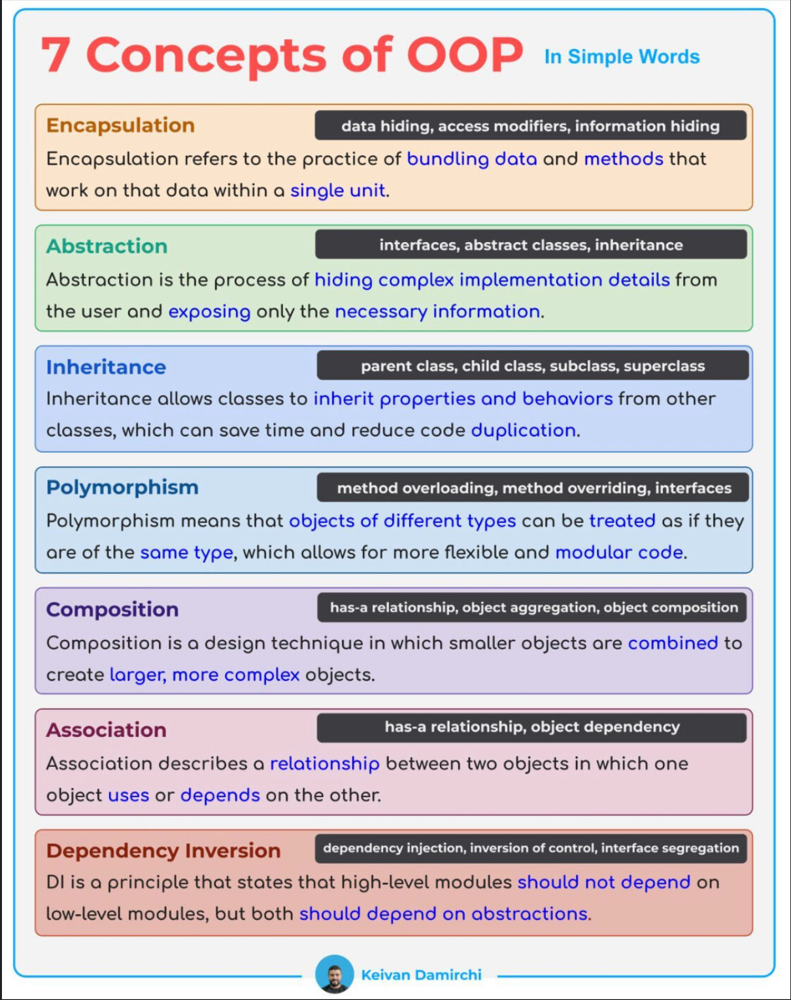

- Propuesta por **Robert C.Martin** en el 2000.
- Son **recomendaciones** para escribir un código **sostenible,mantenible,escalable y robusto**.
- Beneficios:

    - Alta **Cohesión**. Colaboracion entre clases.
    - Bajo **Acoplamiento**. Evitar que una clase dependa fuertemente de otra clase.


- <span style="color:orange">Principio de Responsabilidad Única:</span> Una clase debe tener **una razón** para existir mas no para cambiar.
- <span style="color:orange">Principio de Abierto/Cerrado:</span> Las piezas del software deben estar **abiertas para la extensión** pero **cerradas para la modificación**.
- <span style="color:orange">Principio de Sustitución de Liskov:</span> Las **clases subtipos** deberían ser reemplazables por sus **clases padres**.
- <span style="color:orange">Principio de Segregación de Interfaz:</span> Varias **interfaces** funcionan **mejor que una sola**.
- <span style="color:orange">Principio de Inversión de Dependencia:</span> Clases de **alto nivel** no deben depender de las clases **bajo nivel**.
***
Los principios SOLID son una parte esencial del desarrollo de software orientado a objetos y han demostrado ser herramientas valiosas para desarrollar código limpio, mantenible y extensible. En la tecnología de automatización industrial, especialmente en la programación de controladores con IEC 61131-3, es de particular importancia desarrollar sistemas robustos y confiables.



Además de los principios SOLID, existen otros principios como:


### Keep It Simple, Stupid (KISS).
```
" Mantenlo Simple, Estúpido "
```

- Evite la complejidad innecesaria en su código, use soluciones simples para resolver problemas.

- **Ejemplo:** En lugar de escribir un algoritmo personalizado para generar un número aleatorio dentro de un rango, use el generador de números aleatorios incorporado en su lenguaje de programación.

### Don't Repeat Yourself (DRY).
```
" No te repitas "
```

- Cada pieza de conocimiento debe tener una representación única, inequívoca y autorizada dentro de un sistema.

- Evite la duplicación de código y mantenga su base de código lo más mantenible y escalable posible.

- **Ejemplo:** En lugar de copiar y pegar el mismo bloque de código en varios lugares, cree una función o módulo que se pueda reutilizar.

### Law Of Demeter (LOD).
```
" Habla Solo con tus amigos inmediatos "
```

- La Ley de Demeter (LOD) en programación es un principio que establece que un objeto debe tener acceso limitado a los objetos relacionados con él y solo interactuar con los objetos más cercanos a él. En resumen, un objeto no debe conocer la estructura interna de otros objetos y solo debe comunicarse con ellos a través de una interfaz limitada.

- **Ejemplo:** Si tienes una clase "Persona" que tiene un método "getNombre()" y otra clase "Empresa" que tiene un método "getPersona()". En lugar de acceder directamente al nombre de la persona desde la clase Empresa, se debería llamar al método "getNombre()" de la clase Persona desde fuera de la clase Empresa, para evitar una dependencia innecesaria y mantener una comunicación limitada entre objetos.
### You Ain't Gonna Need It (YAGNI).
```
" No lo vas a necesitar "
```

- No agregue funcionalidad a su código hasta que realmente lo necesite.

- **Ejemplo:** No agregue una función a su aplicación que permita a los usuarios cambiar el color de la fuente si no es parte de los requisitos principales.


Todos estos principios tienen el objetivo común de mejorar la mantenibilidad y la reutilización del software.

Los principios SOLID no son reglas o leyes que deban seguirse estrictamente. Son pautas que pueden ayudarnos a mejorar nuestra calidad de código y habilidades de diseño. No están destinados a ser aplicados ciega o dogmáticamente. Están destinados a ser utilizados con sentido común y juicio.
***
### <span style="color:grey">Links SOLID:</span>
- 🔗 [Cómo explicar conceptos de programación orientada a objetos a un niño de 6 años](https://www.freecodecamp.org/news/object-oriented-programming-concepts-21bb035f7260/#:~:text=The%20four%20principles%20of%20object,abstraction%2C%20inheritance%2C%20and%20polymorphism.)

- 🔗 [iec-61131-3-solid-five-principles-for-better-software,stefanhenneken.net](https://stefanhenneken.net/2021/07/25/iec-61131-3-solid-five-principles-for-better-software/#more-1892)

- 🔗 [Libro SOLID IEC61131-3 en Aleman de Stefanhenneken](https://www.bod.de/buchshop/anwendung-der-solid-prinzipien-mit-der-iec-61131-3-stefan-henneken-9783757870706)

- 🔗 [kentcdodds.com,aha-programming](https://kentcdodds.com/blog/aha-programming)

- 🔗 [Qué son los principios SOLID ? Por qué son tan importantes y verás que ya los aplicas sin saberlo !!](https://www.youtube.com/watch?v=EbpM-i6GZjs)

- 🔗 [Los Principios SOLID explicados ¡Con ejemplos! 100% PRÁCTICO](https://www.youtube.com/watch?v=lUPvI-Kv9UI)

- 🔗 [Cómo implementar los principios SOLID en JAVA](https://www.youtube.com/watch?v=DHq0XvVhhY8)

- 🔗 [Principios de programación SOLID (#Shorts)](https://www.youtube.com/playlist?list=PLTd5ehIj0goPxe8LLVhxZBiOygPk8Aqp8)

- 🔗 [stefanhenneken.net, IEC 61131-3: The Principles KISS, DRY, LoD and YAGNI](https://stefanhenneken.net/2023/12/17/iec-61131-3-the-principles-kiss-dry-lod-and-yagni/)

- 🔗 ["Clean" Code, Horrible Performance](https://www.youtube.com/watch?v=tD5NrevFtbU)

- 🔗 [The SOLID Principles in C#](https://medium.com/@lucas.and227/the-solid-principles-in-c-319755838805)

***
### <span style="color:grey">Link al Video de Youtube 023:</span>
- 🔗 [023 - OOP IEC 61131-3 PLC -- SOLID](https://youtu.be/biuO9x512Zs)


